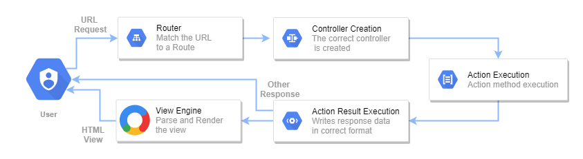

# Controllers, Action Methods & Results, Routing

# ASP.NET MVC

Trainer – Danilo Borozan
---

# AGENDA

- What is a Controller?
- What are Action Methods?
- What is Action Result?
- Routing

---

# WHAT IS A CONTROLLER?

In ASP.NET MVC, a Controller is a class responsible for handling user requests, processing input, and generating responses.

It acts as the intermediary between the user interface (View) and the application logic.

Controllers receive incoming requests, execute the appropriate actions, and return responses to the client.

Controllers in ASP.NET MVC are simply classes with methods (Actions) that represent the end-points or points from or to where we want to send data.

The controller class you create must always inherit from an existing controller class from the ASP.NET framework and it must always be in a folder called `Controllers`.

We can always create our class and inherit from the correct ASP.NET class and create the methods on our own, but Visual Studio makes it easy for us by giving us an option to create a preset controller.

This is done by:
- Right click on the `Controllers` folder
- Add
- Controller
- MVC Empty template

Controllers are named with PascalCase and they ALWAYS HAVE `Controller` at the end.

If they are not named in this way, the application might not work as intended.

An example of a simple controller:

```csharp
public class HomeController : Controller // Must inherit from Controller
{
    // A method ( Action )
    public IActionResult Index() // localhost:port/home/index
    {
        return View(); // When it is called it returns a view
    }
}
```

---

# ROLE OF THE CONTROLLER

## REQUEST HANDLING

Handling incoming HTTP requests from clients, such as web browsers or mobile devices.

## ROUTING

Defining action methods that are invoked based on the route defined in the application's routing configuration.

## PROCESSING INPUT

Processing user input from HTTP requests, including:
- Form data
- Query strings
- Route parameters
- Request headers

## BUSINESS LOGIC

Controllers contain the business logic necessary to interpret and fulfill the user's request.

They interact with the Model layer to perform operations such as:
- Data retrieval
- Manipulation
- Validation

## RESPONSE GENERATION

Generating responses to send back to the client, typically in the form of:
- HTML content
- JSON data
- Other formats

based on the requested action.

---

# INHERITANCE AND BASE CLASSES

Controllers typically inherit from the `Controller` base class provided by the framework.

The `Controller` class provides various helper methods and properties to facilitate request handling and response generation.

Consistent naming convention for controllers helps maintain code readability and organization.

Controllers are named with the `Controller` suffix appended to the logical name of the controller.

Example:
- Controller responsible for managing user accounts → `AccountController`

---

# 🤖 AI Prompt

```text
Explain what a Controller is in ASP.NET MVC as if you are teaching a complete beginner who only knows basic C#.

Use a real-world analogy.
Explain:
- Why controllers exist
- What problem they solve
- How they communicate with Views and Models
- Why controllers must inherit from Controller
- Why naming conventions are important

At the end, give:
- One simple controller example
- One real-world example
- A short summary in very simple language
```

---

# ACTION METHODS 🔹

Actions are the methods that we have in the controller.

Actions are the main source of interaction in and out of the controller.

Every action has an address and when that address is called, the action is executed.

With this, the action can execute some code and return a view or a view with some result in it.

The actions can be annotated depending on the request they are waiting for.

This means that we can have actions that wait for:
- GET request
- POST request
- etc.

In ASP.NET Core MVC applications if we don't annotate our actions, they are by default GET.

If we want to explicitly mark an action with what kind of request it waits we can use the `[HttpXXX]` attribute.

Example:
- GET → `[HttpGet]`

```csharp
public class HomeController : Controller
{
    [HttpGet]
    public IActionResult Index() // localhost:port/home/index
    {
        return View();
    }
}
```

---

# How Action Methods Work

## RECEIVE REQUESTS

Action methods are invoked when a client sends an HTTP request to a specific URL route defined in the application's routing configuration.

## PROCESS INPUT

Action methods receive input data from the request, such as:
- Form data
- Query strings
- Route parameters
- Request headers

## EXECUTE LOGIC

Action methods contain the logic necessary to fulfill the user's request.

They may interact with the model layer to:
- Retrieve data
- Manipulate data
- Validate data

## GENERATE RESPONSES

Action methods return an `ActionResult` object or a specific type derived from `ActionResult`.

This result is used to generate the HTTP response sent back to the client.

---

# When are Action Methods Used?

Action Methods are used in ASP.NET MVC to handle various types of user interactions and perform corresponding actions such as:

- Displaying views or rendering HTML content
- Handling form submissions and processing user input
- Returning JSON or XML data for AJAX requests
- Redirecting users to other pages or actions
- Performing server-side operations and business logic

---

# 🤖 AI Prompt

```text
Explain Action Methods in ASP.NET MVC step by step for beginners.

Include:
- What Action Methods are
- Why every action has a route/address
- How the browser reaches an action
- What IActionResult means
- Why actions are usually public methods
- What happens when an action returns View()

Give:
- 3 simple action examples
- One analogy from real life
- One mini exercise for practice
```

---

# 🤖 AI Prompt

```text
Explain GET and POST requests using a beginner-friendly analogy.

Then explain:
- Why GET is the default in ASP.NET MVC
- When GET should be used
- When POST should be used
- Why forms usually use POST
- Why GET requests should not modify data

Give:
- Real-world examples
- One ASP.NET MVC GET action
- One ASP.NET MVC POST action
```

---

# View Result

An action can return a view.

This means that if someone were to access the address of that action through the browser, they will get an HTML page back.

Attaching a view to an action can be done by:
- Creating a folder with the controller name in the `Views` folder
- Creating a file with the same name as the action

Example:

- We have `HomeController`
- Inside it we have `Index` action
- We create `Home` folder inside `Views`
- Inside `Home` we create `Index.cshtml`

Visual Studio offers a shorter and automatic way of doing this.

If we:
- Right click on the action
- Click `Add View`
- Click `OK`

Visual Studio will:
- Automatically create the folder structure
- Create the view with default HTML

If we don't want to return a view with the same name as the action, we can always pass a string.

---

# ACTION RESULTS

Objects returned by action methods to represent the result of executing the action.

They encapsulate the data to be sent back to the client in the form of an HTTP response.

Action Results derive from the `ActionResult` base class provided by ASP.NET MVC.

Some examples are:
- ViewResult
- PartialViewResult
- ContentResult
- JsonResult
- FileResult
- RedirectResult
- RedirectToRouteResult
- HttpStatusCodeResult
- EmptyResult

---

# Action Result

The results that the action gives back to the browser whether it is a view or some other type of result are always packaged in an Action Result.

That is why the controller returns `IActionResult`.

Meaning:
- It will return some action result that inherits from `IActionResult`

---

# ViewResult

A result used when we want to return some view.

```csharp
// Empty View() will get the view corresponding with this action ( Index )
public IActionResult Index()
{
    return View(); // return type: ViewResult
}
```

```csharp
// A string parameter will return a view by that name from that controller
public IActionResult Index()
{
    return View("Home"); // return type: ViewResult
}
```

---

# EmptyResult

A result representing an empty result.

Used when we don't want to return anything but the browser expects a response.

```csharp
public IActionResult Alert()
{
    // Code that alerts someone
    return new EmptyResult(); // return type: EmptyResult
}
```

---

# RedirectResult

A result that redirects us on the browser to another action.

```csharp
// RedirectToAction accepts an action name (string) and redirects to that action from the same controller
public IActionResult Order(int? id)
{
    // Return type must be IActionResult to cover both return types
    if (id.HasValue) return View(); // return type: ViewResult
    return RedirectToAction("Index"); // return type: RedirectToActionResult
}
```

```csharp
// RedirectToAction accepts an action name(string) and a controller name(string) and redirects to that action from that controller
public IActionResult Order(int? id)
{
    // Return type must be IActionResult to cover both return types
    if (id.HasValue) return View(); // return type: ViewResult
    return RedirectToAction("Index", "Orders"); // return type: RedirectToActionResult
}
```

---

# JsonResult

A result containing a JSON string.

```csharp
// JsonResult accepts an object, converts it to json automatically and returns it
public IActionResult OrderData()
{
    var order = new { Id = 12, IsDelivered = false }; // Dummy Order
    return new JsonResult(order); // return type: JsonResult
}
```

---

# 🤖 AI Prompt

```text
Explain the difference between ViewResult, RedirectResult and JsonResult using simple beginner-friendly examples.

For each one explain:
- What it returns
- When it is commonly used
- What the user sees in the browser
- Why we use it

Then give:
- One ASP.NET MVC example
- One real-world analogy
- One small beginner exercise
```

---

# ROUTING 🔹

The process of mapping incoming HTTP requests to specific controller actions based on the URL pattern.

Responsible for determining which controller and action should handle a particular request.

It helps establish a logical structure for organizing URLs and directing users to the appropriate functionality within the application.

Works by matching the URL of an incoming HTTP request to a predefined route pattern.

The route pattern is defined in the route table, which is typically configured during application startup.

To access our actions in our controllers from the browser we need an address.

In our application, the handling of requests to addresses is called routing and the addresses to the actions are called routes.

The routing is already set with the default setup of our ASP.NET MVC project.

That is the default routing and there is no need for extra configuration.

If we leave the routing by default the routes would look like this:

- website(localhost)/ControllerName/ActionName
- website(localhost)/ControllerName/ActionName/ExtraParameter

Keep in mind that the name of the controller should be written without the `Controller` suffix.

---

# TYPES OF ROUTING IN ASP.NET MVC

## CONVENTIONAL ROUTING

Route patterns are defined using a convention-based approach where URLs are mapped to controller action methods based on predefined conventions.

## ATTRIBUTE-BASED ROUTING

Route patterns are defined using attributes applied directly to controller action methods or controller classes, allowing for more explicit route definitions.

---

# Conventional vs Attribute Routing

## Conventional Routing

Conventional routing is the default routing mechanism in ASP.NET MVC, where routes are defined using a convention-based approach.

Routes are configured globally in the RouteConfig class and follow a predefined pattern based on controller and action names.

## Attribute Routing

Attribute routing allows developers to define routes directly on controller actions using attributes.

Routes are defined using Route attributes applied to action methods, providing more flexibility and control over routing configurations.

Attribute routing can be used in conjunction with conventional routing or as a standalone routing mechanism.

---

# 🤖 AI Prompt

```text
Explain routing in ASP.NET MVC as if you are teaching someone who only knows basic websites.

Explain:
- What routing is
- Why routing exists
- How the browser finds controller actions
- What a URL pattern is
- What conventional routing means
- What attribute routing means

Use:
- Real-world analogies
- Beginner-friendly language
- Simple route examples
- Simple controller examples

At the end:
- Compare conventional and attribute routing
- Explain when each one is useful
```

---

# The Router

The router can be found in `Program.cs`.

```csharp
app.MapControllerRoute(
    name: "default",
    pattern: "{controller=Home}/{action=Index}/{id?}");
```

There we can find:
- Default settings for our router
- The order in which routes are accessed
- Default controller and action values

There is also an `id?` parameter.

The question mark indicates that this parameter is optional.

We can also add new routes to the router.

The default route is:
```txt
localhost:port/Home/Index
```

and it will be hit if we type:
```txt
localhost:port
```

---

# ROUTING ATTRIBUTES

Routing can be done with routing attributes as well.

Attributes are rules that we add in `[ ]` brackets above methods or classes.

With these routing attributes, we can:
- Change routing
- Override routing
- Create custom routes

Example:

```csharp
// Custom route for the controller. Action names stay the same
[Route("App/[Action]")]
public class HomeController : Controller
{
    public IActionResult Index() // localhost:port/app/index
    {
        return View();
    }

    public IActionResult Contact() // localhost:port/app/contact
    {
        return View();
    }
}
```

---

```csharp
[Route("App")]
public class HomeController : Controller
{
    [Route("Start")]
    public IActionResult Index() // localhost:port/app/start
    {
        return View();
    }

    [Route("CallMe")]
    public IActionResult Contact() // localhost:port/app/callme
    {
        return View();
    }
}
```

---

A good thing to mention is that if we leave the route of the controller, but add custom routes to the actions, the actions can be accessed directly without typing the name of the controller in the address.

```csharp
public class HomeController : Controller
{
    [Route("Start")]
    public IActionResult Index() // localhost:port/start
    {
        return View();
    }

    [Route("CallMe/Now")]
    public IActionResult Contact() // localhost:port/callme/now
    {
        return View();
    }
}
```

---

We can also create custom routes for actions by combining the `HttpGet` attribute and the `Route` attribute:

```csharp
[Route("App")]
public class HomeController : Controller
{
    [HttpGet("Start")]
    public IActionResult Index() // localhost:port/app/start
    {
        return View();
    }

    [HttpGet("CallMe")]
    public IActionResult Contact() // localhost:port/app/callme
    {
        return View();
    }
}
```

---

```csharp
public class HomeController : Controller
{
    [HttpGet("Start")]
    public IActionResult Index() // localhost:port/start
    {
        return View();
    }

    [HttpGet("CallMe")]
    public IActionResult Contact() // localhost:port/callme
    {
        return View();
    }
}
```

---

# ROUTE PARAMETERS & CONSTRAINTS

Route parameters allow you to define dynamic parts of a URL within your application's routing system.

They provide a way to extract values from the URL and use them within your controllers or action methods.

Route parameters are enclosed in curly braces `{ }`.

Example:
```txt
/products/{id}
```

In this template:
```txt
{id}
```

is a route parameter representing the product ID.

---

# Constraints

You can apply constraints to route parameters to restrict the values they can accept.

Common constraints include:
- int
- guid
- length

---

# Default Values

Route parameters can have default values, which are used when the corresponding value is not provided in the URL.

---

# Multiple Route Parameters

You can define multiple route parameters within a single route template, separated by slashes.

---

# Routing with Extra Parameters

As we can tell from the default router of an ASP.NET Core MVC application, we can access an action by writing the controller name first and then the action name.

But we can add an extra parameter as well.

This is optional.

To use this optional parameter we need to create an action first that accepts a parameter.

```csharp
// id will get the number from the address ( 12 )
public IActionResult Contact(int? id) // localhost:port/home/contact/12
{
    return View();
}
```

---

# 🤖 AI Prompt

```text
Explain route parameters and route constraints in ASP.NET MVC using simple beginner-friendly examples.

Explain:
- What route parameters are
- Why they are useful
- How ASP.NET MVC extracts values from URLs
- What constraints are
- Why constraints help applications

Give:
- 3 route examples
- 3 controller action examples
- One analogy from real life
- One beginner practice exercise
```

---



---

# 🤖 Copilot Tip

GitHub Copilot can help you with:
- Creating controllers
- Generating action methods
- Writing route attributes
- Creating IActionResult methods
- Generating RedirectToAction examples

Before accepting suggestions:
- Read the code carefully
- Make sure you understand it
- Verify the route works in the browser
- Check if the controller and action names are correct

---

# QUESTIONS?

You can find me at:

daniloborozan07@gmail.com