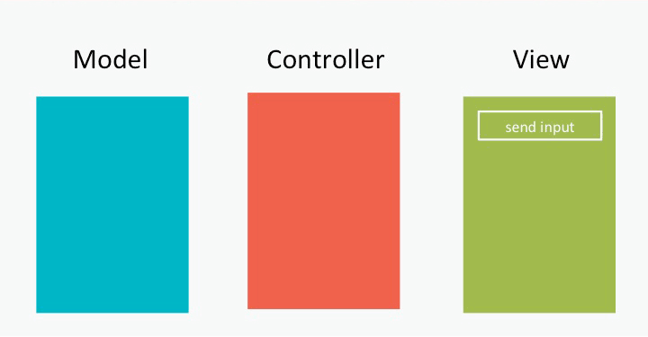
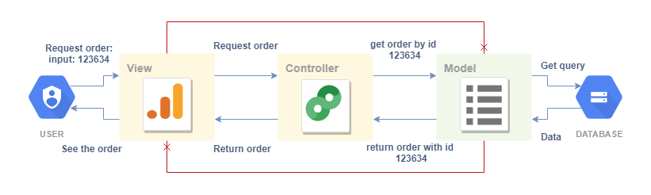

# ASP.NET MVC Web Applications

# ASP.NET MVC

Trainer – Tijana Stojanovska

---

# RETROSPECTIVE - WHERE WE ARE

October  
- You learned basic programming principles on the whiteboard or on paper.

January  
- You learned what front-end is and how to build static client-based web applications.

May  
- You learned SQL and how databases work.

June  
- You learned a powerful back-end language.

TODAY  
- You are finally ready to build a full end-to-end web application with all the bells and whistles.

---

# ABOUT THE SUBJECT

The subject consists of 10 modules.

The focus of the subject will be:
- Building dynamic web applications using ASP.NET
- Understanding the MVC pattern
- Connecting front-end and back-end
- Working with databases
- Building complete end-to-end solutions

There will be one application that we will gradually build throughout the subject, together with homework features and exercises.

README materials and GitHub repositories will be provided as guides for the classes.

---

# DYNAMIC WEB APPLICATIONS?

Dynamic web applications are applications that consist of:
- Client-side applications
- Server-side applications

In this subject we will:
- Use ASP.NET for web development
- Use MVC to organize the application
- Connect the application to a database
- Build a complete end-to-end solution

---

# EXPECTATIONS AND GOALS

Before starting this subject, students are expected to know:
- C#
- Object-oriented programming concepts
- HTML, CSS and JavaScript basics
- SQL and databases

The focus of this subject will be to combine everything learned so far into one complete web application.

---

# ASP.NET Explained 🍩

## What is ASP.NET?

ASP.NET (Active Server Pages Network Enabled Technologies) is a framework specifically designed for building server-side web applications.

With ASP.NET we can build:
- Web applications
- APIs
- End-to-end solutions
- Dynamic websites

ASP.NET provides features for:
- Handling HTTP requests
- Routing URLs
- Configuring web applications
- Connecting front-end and back-end
- Managing application flow

Originally ASP.NET was built for the .NET Full Framework, but later evolved into ASP.NET Core, which supports:
- Windows
- Linux
- macOS

---

# Difference between C#, .NET, ASP.NET and Visual Studio

## C#

C# is a programming language.

It contains:
- Syntax
- Keywords
- Rules for writing code

Example:
```csharp
Console.WriteLine("Hello World");
```

C# code alone cannot run without .NET.

---

## .NET

.NET is a software framework and runtime developed by Microsoft.

It:
- Compiles C# code
- Executes applications
- Provides libraries and tools
- Helps manage application execution

There are two major versions:
- .NET Framework ( older )
- .NET Core / .NET ( modern and cross-platform )

---

## ASP.NET

ASP.NET is a web framework built on top of .NET.

It contains features for:
- Web applications
- HTTP request handling
- Routing
- MVC support
- APIs
- Server-side rendering

ASP.NET allows us to use C# for web development.

---

## Visual Studio

Visual Studio is an IDE (Integrated Development Environment).

It helps developers:
- Write code
- Debug applications
- Create projects from templates
- Detect syntax errors
- Use IntelliSense suggestions

Visual Studio contains templates for:
- Console applications
- ASP.NET MVC applications
- APIs
- Class libraries

---

# 🤖 AI Prompt — Beginner Friendly Explanation

```text
Explain the difference between C#, .NET, ASP.NET and Visual Studio using a real-world analogy for complete beginners.
```

---

# MVC AS A PATTERN

MVC stands for:
- Model
- View
- Controller

MVC is an architectural design pattern used to organize applications.

MVC divides the application into three separate parts.

---

# MODEL

The Model:
- Represents the data
- Contains business logic
- Communicates with the database

The model does NOT know anything about the user interface.

---

# VIEW

The View:
- Displays data to the user
- Handles the user interface
- Sends user interactions to the controller

The view does NOT communicate directly with the database.

---

# CONTROLLER

The Controller:
- Receives requests from the user
- Processes the request
- Communicates with the model
- Returns data to the view

The controller acts as the middleman between the View and the Model.

---

# What is a Design Pattern? 🔹

A design pattern is:
- NOT a framework
- NOT a programming language
- NOT a library

A design pattern is a structured solution to a common problem.

MVC is an architectural design pattern because it helps organize software structure and communication.

MVC can be used in:
- Web applications
- Desktop applications
- Mobile applications

---

# 🤖 AI Prompt — Explain MVC Simply

```text
Explain MVC using a restaurant analogy for complete beginners.
Explain what the Model, View and Controller would represent in the restaurant.
```

---

# How MVC Works 🔹

The flow of MVC usually looks like this:

1. User interacts with the VIEW
2. VIEW sends request to CONTROLLER
3. CONTROLLER processes the request
4. CONTROLLER communicates with MODEL
5. MODEL retrieves data
6. MODEL returns data to CONTROLLER
7. CONTROLLER updates the VIEW
8. User sees the result



---

# MVC Flow Example

Example:
- User clicks "View Products"
- Controller receives request
- Model retrieves products from database
- Controller sends products to View
- View displays products



---

# CONTROLLER Explained

The Controller:
- Accepts requests from users
- Processes data
- Calls services or models
- Returns responses

The controller separates:
- User interface
- Business logic
- Data access

This makes applications:
- More organized
- More secure
- Easier to maintain

---

# 🤖 AI Prompt — Controller Explanation

```text
Explain what a Controller does in ASP.NET MVC using simple beginner-friendly examples.
Give 3 examples of controller actions.
```

---

# MODEL Explained

The Model:
- Stores application data
- Represents business logic
- Communicates with the database

The Model only communicates with the Controller.

The Model does NOT know:
- Who the user is
- What the UI looks like

---

# 🤖 AI Prompt — Model Explanation

```text
Explain what a Model is in ASP.NET MVC using an online shop example.
```

---

# VIEW Explained

The View:
- Displays data to users
- Handles UI rendering
- Receives data from Controllers

The View should NOT:
- Access the database directly
- Contain business logic

---

# 🤖 AI Prompt — View Explanation

```text
Explain what a View is in ASP.NET MVC using beginner-friendly examples.
```

---

# Why MVC is Awesome 🔹

Without proper structure:
- Applications become messy
- Code becomes hard to maintain
- Features become difficult to add
- Security becomes weaker

MVC solves these problems by:
- Organizing code
- Separating concerns
- Improving maintainability
- Improving scalability
- Making development faster

Benefits of MVC:
- Easier navigation through code
- Better organization
- Cleaner architecture
- Easier testing
- Easier teamwork

---

# 🤖 AI Prompt — Why MVC?

```text
Explain why MVC is useful compared to putting all code in one file.
Use beginner-friendly explanations.
```

---

# Creating an ASP.NET MVC Project ( Demo )

## Demo Steps

- Open Visual Studio
- Create a new ASP.NET MVC project
- Explore the folder structure
- Run the application
- Open the browser
- Explain Controllers, Models and Views folders

---

# Exercise

## Individually create an ASP.NET MVC project

Requirements:
- Create a new MVC project
- Run the application
- Explore the generated folders
- Identify:
  - Controllers
  - Models
  - Views
  - wwwroot
  - Program.cs

---

# 🤖 AI Prompt — Folder Structure

```text
Explain the folder structure of an ASP.NET MVC project for beginners.
Explain what each folder is responsible for.
```

---

# Additional Beginner-Friendly AI Prompts

## 🤖 Understanding HTTP

```text
Explain HTTP requests and responses using simple real-world examples.
```

## 🤖 Understanding Web Applications

```text
Explain the difference between static and dynamic web applications for beginners.
```

## 🤖 Understanding End-to-End Applications

```text
Explain what an end-to-end web application is using a real-world example like an online shop.
```

## 🤖 Understanding Backend vs Frontend

```text
Explain frontend and backend development using a simple analogy.
```

## 🤖 Understanding Frameworks

```text
Explain what a framework is and why developers use frameworks.
```

---

# QUESTIONS?

You can find me at:

stojanovska_tijana@outlook.com